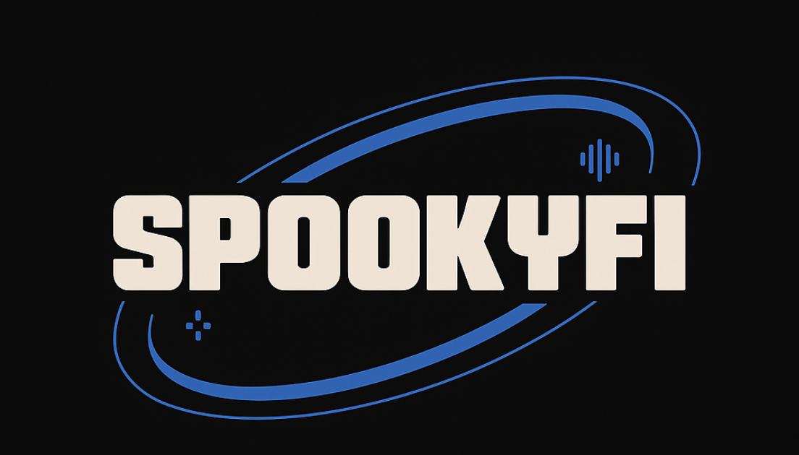
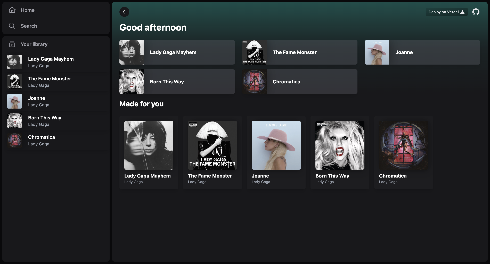
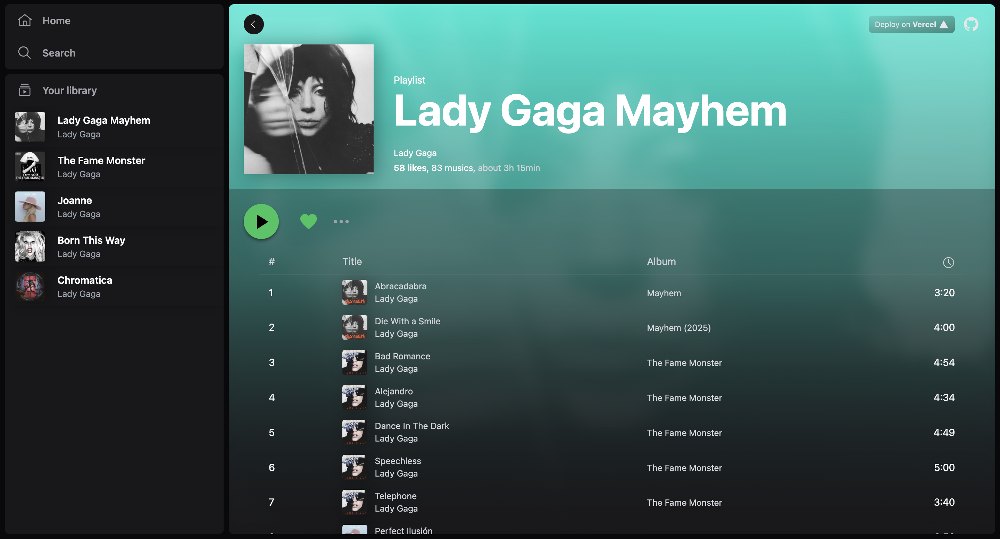
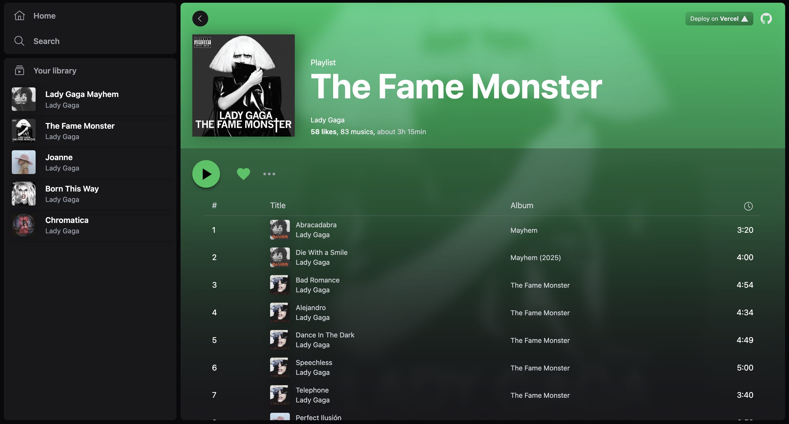
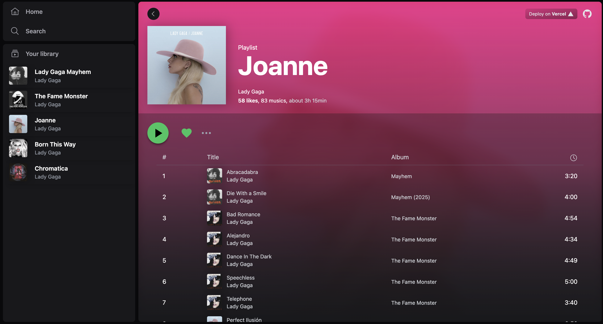
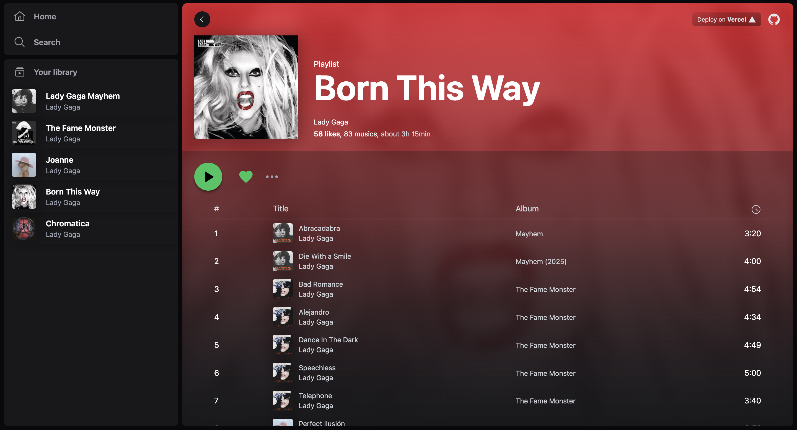
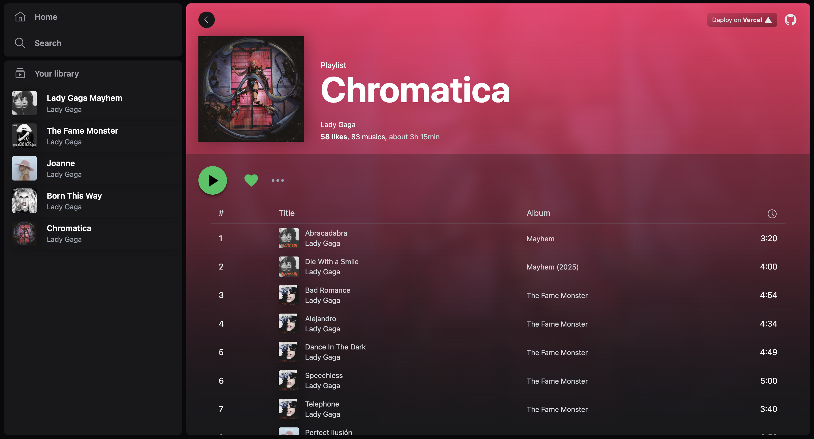
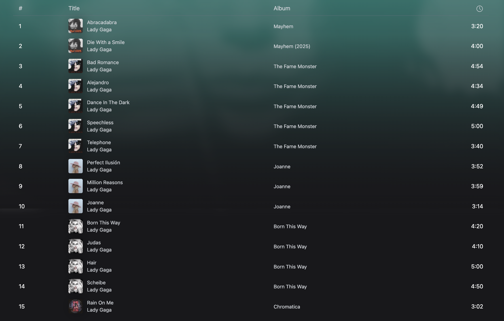

# Spookyfi - Lady Gaga Albums — View Transitions Visual Demo  
[](https://astro.build)

Una demo visual construida con [Astro View Transitions](https://docs.astro.build/en/guides/view-transitions/), inspirada en la discografía y el amor por **Lady Gaga**. Este proyecto no es un clon de Spotify, sino un homenaje a sus eras musicales, usando animaciones fluidas para crear una experiencia visual única.

---
## 🚀 Deploy

[Vercel](https://spookyfi-view-transitions.vercel.app/)

---
## ✨ Características
* Vista inicial con cinco álbumes de Lady Gaga.
* Detalles individuales por álbum, con transiciones fluidas.
* Fondos y estilos únicos por era:
    - 💀 *The Fame Monster* 
    - 🖤 *Mayhem* 
    - 🌙 *Joanne* 
    - 🫀 *Born This Way* 
    - 🪩 *Chromatica* 
* Portadas personalizadas desde `/public/images`.
* Transiciones suaves con `ViewTransitions API` y estilos dinámicos.

---

## 🚀 Instalación y uso
1. Clonar el repositorio:
```bash
git clone https://github.com/spookycoincidence/Spookyfi-ViewTransitions
```
2. Instalar dependencias:
```bash
cd Spookyfi-ViewTransitions
npm install
```
3. Correr la app en modo desarrollo:
```bash
npm run dev
```
4. Abrir http://localhost:3000 en el navegador

## 📸 Screenshots

  

---

  

---

  

---

  

---

  

---

  

---

  

---

## 🪄 Tecnologías
* 💜 [Astro 3.0](https://astro.build)
* 💜 CSS Modules
* 💜 TypeScript
* 💜 View Transitions API (experimental)

## Desarrollado con ❤️ por spookycoincidence